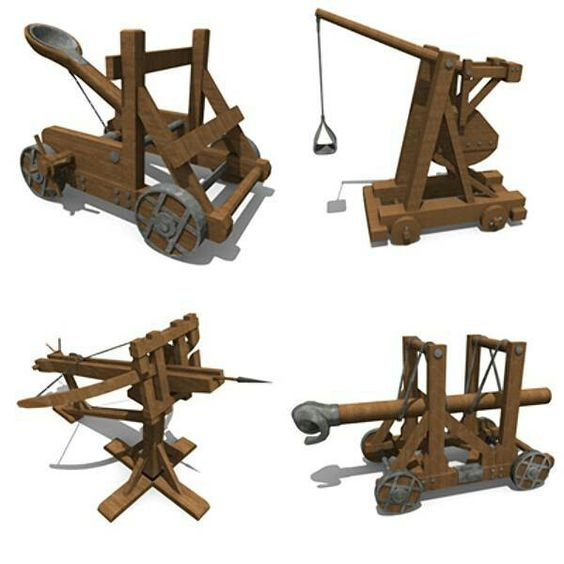

# Trebuchet medieval

## Presentación

El trebuchet era un arma utilizada en la Edad Media 
para asediar un castillo. Se utilizaban diversos 
proyectiles arrojadizos: grandes piedras para 
destruir las murallas, "fuego griego" para incendiar 
el castillo, pedernal en bolas de arcilla que se 
rompía en mil pedazos al golpear, e incluso 
cadáveres infectados para propagar enfermedades 
en el castillo asediado. Sí, si apresabas a un espía, 
podías enviarlo de vuelta utilizando el trebuchet. 
El trebuchet podía disparar con gran precisión y 
hasta 400 metros. 

Al principio funcionaban con fuerza humana, con una docena de hombres que tiraban de una cuerda para hacer funcionar el mecanismo. Más tarde llegó el trebuchet o trebuquete, un invento atribuido a Mardi Ibn Ali al-Tarsusi, un tipo de catapulta que utiliza la energía potencial de un contrapeso para lanzar el proyectil más lejos y con más potencia que con las antiguas catapultas. En este trabajo se lleva a cabo un breve estudio histórico y posteriormente el modelado geométrico, el análisis mecánico, su funcionamiento y la reproducción a escala real del dispositivo.

De la necesidad de ataque y defensa que se produce en épocas de guerra, han surgido grandes avances tecnológicos que tras su perfeccionamiento pasan a formar parte de la vida cotidiana, como es el caso del invento del trebuchet de contrapeso, el cual surge a raíz de las guerras de asedio durante las Cruzadas del siglo XII, y que supuso un importante avance respecto a las máquinas existentes por su mayor precisión y capacidad de alcance. No se conoce de manera exacta su origen o su desarrollo a partir de mecanismos de tensión o a partir de la evolución de mecanismos de torsión. Lo que sí parece claro en atribuir este artefacto a Mardi Ibn Ali al-Tarsusi. La influencia del mecanismo de contrapeso que utilizaba el trebuchet ha sido tan importante, que podemos encontrarlo en multitud de sistemas modernos.

## Instalaciòn 

Para instalar (construir y montar) un trebuchet medieval, aquí está el proceso general:
Construcción de los componentes principales
1. La base y estructura

Construye un marco robusto de madera (generalmente roble o pino resistente) en forma de "A" o "H"
La base debe ser muy pesada y estable, a menudo se enterraba parcialmente o se lastaba con piedras

2. El brazo oscilante

Fabrica un brazo largo de madera dura (proporción típica 4:1 entre el lado del contrapeso y el lado de la honda)
El extremo corto llevará el contrapeso
El extremo largo tendrá la honda con el proyectil

3. El eje de rotación

Instala un eje transversal fuerte entre los dos postes verticales
Debe ser de metal o madera muy dura
Coloca el brazo oscilante sobre este eje en el punto de equilibrio adecuado

4. El contrapeso

Construye una caja o canasta en el extremo corto del brazo
Llénala con piedras, arena o plomo (peso típico: 100-200 veces el proyectil)

5. La honda

Fabrica una honda de cuerda o cuero
Un extremo se fija al brazo, el otro tiene un gancho que se suelta automáticamente

Montaje final

Ensambla todo verificando que el brazo pueda girar libremente
Ajusta el punto de liberación de la honda mediante pruebas
Asegura la estructura completa al suelo

## Agradecimiento 

